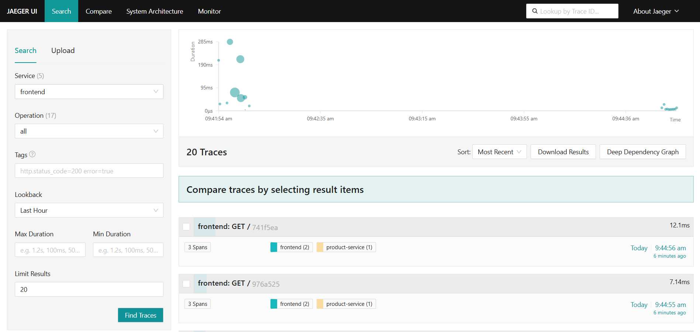

# ✅ CHECKLIST FINALE - TP OpenTelemetry

## 🎯 Ce qui est TERMINÉ

### Documentation ✅
- [x] README.md complet avec architecture visuelle
- [x] Rapport_TP_OpenTelemetry.md (1039 lignes) en première personne
- [x] PRESENTATION_GUIDE.md pour la présentation orale
- [x] Architecture avec 4 images PNG intégrées

### Code & Configuration ✅
- [x] Instrumentation OpenTelemetry dans tous les services
- [x] docker-compose.yml centralisé (12 conteneurs)
- [x] Configuration OTel Collector (traces + metrics + logs)
- [x] Configuration Prometheus avec alertes
- [x] Dashboards Grafana provisionnés
- [x] Scripts de tests (crash, latence, K6)

### Infrastructure ✅
- [x] 4 services applicatifs instrumentés
- [x] 3 bases de données MySQL
- [x] Stack d'observabilité complète (Jaeger, Prometheus, Loki, Grafana)
- [x] Réseau Docker unifié
- [x] Volumes persistants

---

## 📸 CE QU'IL RESTE À FAIRE

### 1. PRENDRE LES CAPTURES D'ÉCRAN (30 minutes)

**Étape 1** : Lancer le script d'ouverture automatique
```bash
./ouvrir_pour_captures.sh
```

**Étape 2** : Prendre 6 captures obligatoires (voir CAPTURES_GUIDE.md)
- [ ] Jaeger : Liste des traces → `img/jaeger-traces-list.png`
- [ ] Jaeger : Détail trace → `img/jaeger-trace-detail.png`
- [ ] Prometheus : Targets → `img/prometheus-targets.png`
- [ ] Prometheus : Métriques → `img/prometheus-metrics.png`
- [ ] Prometheus : Alertes → `img/prometheus-alerts.png`
- [ ] Grafana : Dashboard → `img/grafana-dashboard.png`

**Étape 3** : Captures optionnelles (recommandées)
- [ ] Frontend : Page accueil → `img/frontend-home.png`
- [ ] Frontend : Produits → `img/frontend-products.png`

---

### 2. INTÉGRER LES CAPTURES DANS LE RAPPORT (15 minutes)

Une fois les captures prises, elles doivent être ajoutées dans `Rapport_TP_OpenTelemetry.md` aux endroits suivants :

#### Section 4.2.2 - Exemple de trace (ligne ~360)
```markdown

*Liste des traces capturées montrant les services instrumentés*


*Timeline détaillée d'une requête traversant frontend → product-service*
```

#### Section 4.3.1 - Target OTel Collector (ligne ~375)
```markdown

*Le collecteur OpenTelemetry est correctement scrapé par Prometheus (status UP)*
```

#### Section 4.4 - Dashboards Grafana (ligne ~420)
```markdown

*Dashboard de monitoring avec 5 panels affichant les métriques en temps réel*
```

#### Section 7.2 - Alertes Prometheus (ligne ~800)
```markdown

*Configuration des alertes HighErrorRate et HighLatency*
```

---

### 3. GÉNÉRER LE PDF FINAL (5 minutes)

**Option A - Pandoc (recommandé)** :
```bash
pandoc Rapport_TP_OpenTelemetry.md -o Rapport_TP_OpenTelemetry.pdf \
  --pdf-engine=xelatex \
  --toc \
  --number-sections \
  -V geometry:margin=2.5cm \
  -V fontsize=11pt \
  -V lang=fr
```

**Option B - VS Code** :
1. Ouvrir `Rapport_TP_OpenTelemetry.md`
2. Clic droit → "Markdown PDF: Export (pdf)"
3. Attendre la génération

**Option C - GitHub/Typora** :
1. Push sur GitHub
2. Ouvrir le fichier sur GitHub
3. Imprimer → Enregistrer comme PDF

---

### 4. NETTOYER LE PROJET (5 minutes)

**Supprimer les fichiers temporaires** :
```bash
rm -f architecture-mermaid.md architecture.puml architecture-c4.puml \
      architecture-drawio-guide.md generer_pdf.sh generer_rapport.sh \
      README.md.old observability.txt setup_grafana_dashboard.sh \
      RAPPORT_TP.pdf
rm -rf otel-collector-config.yml/
```

**Vérification finale** :
```bash
ls -lh *.md
# Devrait montrer :
# - Rapport_TP_OpenTelemetry.md
# - README.md
# - PRESENTATION_GUIDE.md
# - CAPTURES_GUIDE.md
# - TODO.md (ce fichier)
```

---

### 5. PRÉPARER LA PRÉSENTATION (30-45 minutes)

**Suivre le guide** : `PRESENTATION_GUIDE.md`

**Créer le PowerPoint** avec :
- Slide 1 : Titre + Contexte
- Slide 2 : Architecture (utiliser ArchitectureGlobale.png)
- Slide 3 : Flux de données (utiliser FluxdeDonnéesTélémétriques.png)
- Slide 4 : Traces Jaeger (capture écran)
- Slide 5 : Métriques Prometheus (capture écran)
- Slide 6 : Dashboard Grafana (capture écran)
- Slide 7 : Alerting (capture écran + explication)
- Slide 8 : Démonstration live
- Slide 9 : Problèmes rencontrés et solutions
- Slide 10 : Conclusion et apprentissages

---

## 📦 LIVRAISON FINALE

### Fichiers à soumettre
```
📁 TP_OpenTelemetry_Oumar_Marame/
├── 📄 Rapport_TP_OpenTelemetry.pdf         (obligatoire)
├── 📄 README.md                            (obligatoire)
├── 📁 Code source complet/                 (obligatoire)
│   ├── docker-compose.yml
│   ├── otel-collector-config.yaml
│   ├── prometheus.yml
│   ├── frontend/
│   ├── user-service/
│   ├── product-service/
│   ├── order-service/
│   └── scripts/
├── 📁 img/                                 (obligatoire)
│   ├── ArchitectureGlobale.png
│   ├── FluxdeDonnéesTélémétriques.png
│   ├── PipelineOpenTelemetry.png
│   ├── ArchitectureRéseauDocker.png
│   ├── jaeger-traces-list.png
│   ├── jaeger-trace-detail.png
│   ├── prometheus-targets.png
│   ├── prometheus-metrics.png
│   ├── prometheus-alerts.png
│   └── grafana-dashboard.png
└── 📊 Presentation.pptx                    (recommandé)
```

### Format de soumission
1. **ZIP le tout** : `TP_OpenTelemetry_Oumar_Marame.zip`
2. **Vérifier la taille** : < 50 MB (exclure .git/, __pycache__/)
3. **Tester l'archive** : Extraire et vérifier que tout est présent

---

## ⏰ TEMPS ESTIMÉ

| Tâche | Temps |
|-------|-------|
| Captures d'écran | 30 min |
| Intégration dans rapport | 15 min |
| Génération PDF | 5 min |
| Nettoyage projet | 5 min |
| Préparation présentation | 45 min |
| **TOTAL** | **1h40** |

---

## 🚀 COMMANDES RAPIDES

```bash
# 1. Démarrer la stack
docker compose up -d

# 2. Générer du trafic
./test_traces.sh

# 3. Ouvrir toutes les URLs
./ouvrir_pour_captures.sh

# 4. Vérifier l'état
docker compose ps

# 5. Arrêter la stack
docker compose down

# 6. Créer le ZIP final
zip -r TP_OpenTelemetry_Oumar_Marame.zip . \
  -x "*.git*" "*__pycache__*" "*.pyc" "*venv*" "*node_modules*"
```

---

## ✅ VALIDATION FINALE

Avant de soumettre, vérifier :

- [ ] Le rapport PDF contient toutes les captures d'écran
- [ ] Toutes les images s'affichent correctement
- [ ] Le code source est complet et fonctionnel
- [ ] Le docker-compose.yml démarre sans erreur
- [ ] Les 3 types de signaux sont collectés (traces, metrics, logs)
- [ ] Les dashboards Grafana affichent des données
- [ ] Les alertes Prometheus sont configurées
- [ ] La présentation PowerPoint est prête
- [ ] Le ZIP final est < 50 MB
- [ ] Tous les fichiers temporaires sont supprimés

---

## 📞 EN CAS DE PROBLÈME

### Stack ne démarre pas
```bash
docker compose down -v
docker compose up -d --build
```

### Pas de traces dans Jaeger
```bash
./test_traces.sh
docker compose logs otel-collector | grep -i error
```

### Grafana vide
```bash
# Vérifier les data sources
curl http://localhost:3000/api/datasources -u admin:admin
```

### Pandoc introuvable
```bash
# Utiliser l'option B ou C pour générer le PDF
```

---

## 🎓 DEADLINE

**Date limite** : 26 octobre 2025, 23:59
**Format** : Moodle (ZIP)
**Présentation** : Semaine du 28 octobre 2025

---

**Bon courage pour la finalisation ! 🚀**
